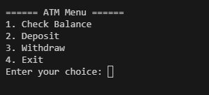
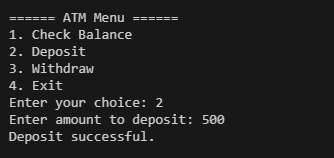
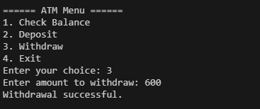
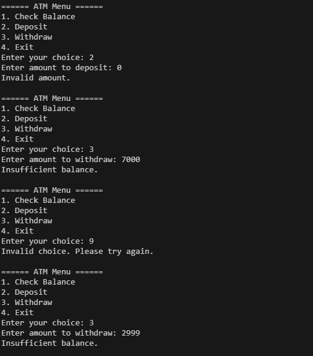

#Java ATM Program 💳

This is a simple **ATM (Automated Teller Machine)** simulation program written in Java. It allows users to:
- Check their balance
- Deposit money
- Withdraw money
- Exit the application

The program uses basic Java concepts such as:
- Loops
- Conditionals
- Methods
- Static variables
- Scanner for user input

---

## 🧾 Features

1. ✅ Check Balance  
2. 💰 Deposit Amount  
3. 💸 Withdraw Amount  
4. 🚪 Exit the Program

---

## 🔧 How It Works

- The user is shown a menu with options.
- The user selects an option by entering a number.
- Based on the selection, the corresponding method is executed.
- The program continues running until the user selects "Exit".

---

## 🛠️ Requirements

- Java JDK (version 8 or above)
- A Java IDE like IntelliJ, Eclipse, or simply a text editor + command line

---

## ▶️ Run the Program

1. **Clone the repo**  
```bash
git clone https://github.com/Sourav5482/java-atm.git
cd java-atm
```

2. **Compile and Run**  
```bash
javac Main.java
java Main
```

---

## 📂 File Structure

```
java-atm/
│
├── Main.java       # The main ATM simulation program
├── README.md       # This file
└── screenshots/    # Folder for images
    ├── menu.png
    ├── deposit.png
    ├── withdraw.png
    └── error.png
```

---

## 📸 Sample Screenshots

### 🧽 Menu


### 💰 Deposit


### 💸 Withdraw


### ❌ Invalid Input


---

## 🙌 Author

- **Sourav Das**
- 📧 Portfolio: [sourav5482.github.io](https://sourav5482.github.io/Portfolio/)

---

## 📜 License

This project is licensed under the MIT License - feel free to use and modify it.

